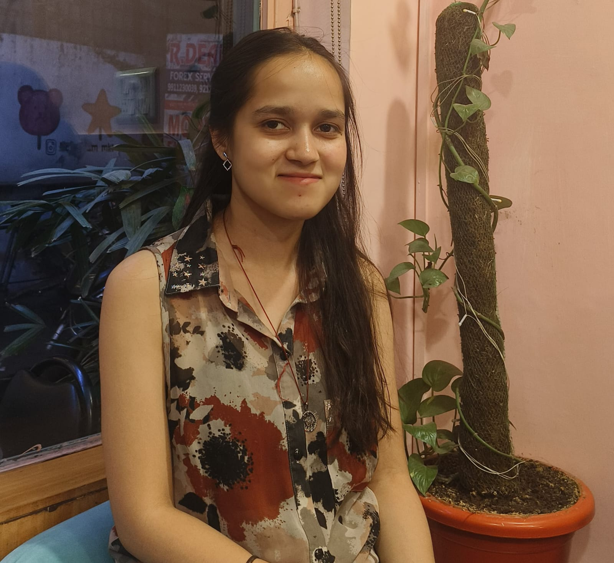

  <!-- Profile Image -->
  

    
  

  <!-- About Section -->
  

    <h3 style="margin: 0;">About</h3>
    

      Hi, I’m currently working as a Research Associate with  <a href="https://aadityadar.com/" target="_blank">Dr. Aaditya Dar (Amazon)</a>. I have a master's degree in Economics from <a href="https://www.jnu.ac.in" target="_blank">Jawaharlal Nehru University</a> and a Bachelor's degree in Mathematics from <a href="https://www.sharda.ac" target="_blank">Sharda University</a>. My research interests lie broadly in development economics, with a focus on how policies, institutions, and technological innovations shape economic opportunities for low-income households.
    

    

     I enjoy working with data to make causal inferences that turn numbers into meaningful insights for policy making. 
    

    

      <b>Primary Interest:</b> Environmental Economics, Development Economics 
      <b>Secondary Interest:</b> Agricultural Economics, Labor Economics  
      

    <b>Contact:</b> <a href="mailto:deepanshirai123@gmail.com">deepanshirai123@gmail.com</a>

      

    

  

